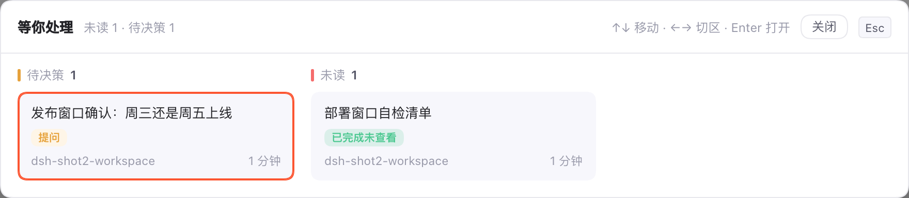

<sub>🌐 <b>中文</b> · <a href="#english">English</a></sub>

<div align="center">

# dsh-session-radar

> *「重启也不丢的未读，和正在等你的那一个。」*

[](https://www.npmjs.com/package/dsh-session-radar)
[](https://www.npmjs.com/package/dsh-session-radar)
[](LICENSE)
[](https://github.com/deepseek-ai/deepseek-harness)

**DSH 侧边栏的未读与待办中枢：`⌘⇧J` 按顺序定位未读会话，`⌘⇧I` 处理正在等你输入的会话（提问 / 审批 / 计划审阅），`⌘⇧K` 弹出「等你处理」总览——所有未读与待决策的会话分成两区铺成卡片网格，一眼看清还欠多少；账本落在 host 半边，重启也不丢——**上次退出时还在跑的会话，下次启动就算未读**，`⌘⇧J` 一步走到。侧边栏底部另有一行六项会话状态读数，设置页可逐项开关。**

[效果](#效果) · [安装](#安装) · [装完怎么确认](#装完怎么确认) · [怎么用](#怎么用) · [等你处理总览](#等你处理总览k) · [会话状态读数](#会话状态读数六项计数) · [已知限制](#已知限制) · [安全边界](#安全边界) · [兼容性](#兼容性)

</div>

---


---

## 它解决什么问题

同时开着四五个 DSH 会话，你去泡了杯咖啡回来——哪个跑完了？哪个正在等你点确认？

侧边栏默认列表不回答这两个问题；官方那个红点只在浏览器标签上闪一下，刷新、重启就没了。

这个插件把两件事搬回侧边栏：

- 一个**红色角标**告诉你还欠几个「跑完没看」的会话，`⌘⇧J` 带你按顺序一个个过；
- 一个**黄色角标**（铃铛左上角）告诉你谁在**等你输入**——提问、审批、计划审阅都算，`⌘⇧I` 带你处理，处理完再按一下会**原路返回**；
- 想知道**总账**时按 `⌘⇧K`：所有未读与待决策的会话在一个弹窗里铺成两区网格，不用一个接一个按过去才知道还有多少；
- 两者的账本由 host 半边持有，写进 `$DSH_HOME/session-radar.json`，**重启 dsh 后欠的账还在**；
- **上次退出时还没跑完的会话，下次启动直接算未读**（见「被重启打断的会话」），不会因为当时没看到就被忘在列表里；
- 启动时还会弹一次**续跑清单**：把被打断的会话列出来、默认全勾，按一下就把续跑消息批量发过去（见「重启后的续跑弹窗」）。

## 效果

未读和「等待你处理」是两个独立角标——右上红色是跑完没看的，左上黄色是等你输入的，同时出现也互不顶掉：


- `⌘⇧J`：按顺序走未读会话，走到末尾绕回第一个；
- `⌘⇧I`：先走等待项（最早开始等待的排最前），处理完再按就跳到下一个；没有等待项了，再按会**沿原路返回**你上一个停留点；
- `⌘⇧K`：弹出「等你处理」总览——左边一列是**待决策**（提问 / 审批 / 计划审阅），右边网格是**未读**，方向键选、Enter 打开、再按一次 `⌘⇧K` 或 Esc 关掉。

三个出口读的是同一份投影，所以角标数字、跳转顺序、总览卡片永远一致：

```text
官方快照                       投影                                 出口
──────────────────────       ──────────────────────────────       ────────────────────────
Session 列表            ┐
Session 状态            ├──→   未读 = 账本 ∪ 官方完成未读      ├──→ 红色角标 + ⌘⇧J 顺序定位
Workspace 归档集        ┘            ∪ 本地完成沿 ∪ 手动标记     ├──→ 黄色角标 + ⌘⇧I 待处理队列
                                待处理 = 官方 pendingInteraction  └──→ ⌘⇧K 总览（待决策 / 未读两区）
账本（host 半边，落盘） ────→   跨刷新、跨重启都不丢的未读
```

## 安装

三档，任选一条。npm 上的发布版本可能落后于仓库 HEAD——要用仓库最新功能就走 GitHub 或本地目录安装。版本变更记录见 [`CHANGELOG.md`](CHANGELOG.md)。

### npm（推荐）

```sh
dsh plugin --profile web add dsh-session-radar
```

### GitHub

```sh
dsh plugin --profile web add github:d0ublecl1ck/dsh-session-radar
```

仓库把构建产物 `lib/` 一起提交了，git 安装不需要本地 build。

### 本地目录

```sh
dsh plugin --profile web add /绝对路径/dsh-session-radar
```

### 装完让它生效

1. 页面开着的话刷新一下；**如果这次是插件代码本身的更新，请来一次硬刷新（`⌘⇧R` / `Ctrl+Shift+R`）**——客户端 bundle 由宿主以 `cache-control: public, max-age=31536000, immutable` 分发，普通刷新可能直接命中旧缓存，症状是「功能明明装了却完全没反应」；
2. 卸载：`dsh plugin --profile web remove dsh-session-radar`。

> **改了 host 半边（`src/host.ts`）之后必须 `remove` + `add`**：宿主按 URL 缓存模块，只 `add` 不会重新导入；症状是"改了没生效"。

## 装完怎么确认

| 你看到什么 | 状态 | 怎么办 |
| --- | --- | --- |
| 侧边栏「工作区」标题右边多了一个铃铛 | 装上了 | — |
| 铃铛右上角红色数字 | 有跑完没看的会话 | `⌘⇧J`，或点铃铛 |
| 铃铛左上角黄色数字 | 有会话在等你处理 | `⌘⇧I`，或 `⌘⇧K` 看总览 |
| `⌘⇧K` 弹出「等你处理」两区网格 | 装上了 | 方向键选卡片，Enter 打开，Esc 关闭 |
| 看不到铃铛 | 侧边栏折叠成了 56px 轨道 | 展开侧边栏 |
| 铃铛在，但角标一直不清 | 浏览器到 host 的桥接失败 | 先刷新页面；仍不行看「已知限制」 |

## 怎么用

| 操作 | 结果 |
| --- | --- |
| 左键点铃铛 | 定位到下一个未读会话：滚动到可见并在对话栏打开；再点继续往后走，末尾绕回第一个 |
| 红色角标 | 已完成未查看的会话数（见「未读从哪来」） |
| 黄色角标 | 正在等你处理的会话数：审批、计划审阅、提问都算；与红色角标分开计数，不会互相顶掉 |
| 快捷键 J | 与左键点铃铛同一个跳转，默认 macOS `⌘⇧J`、Windows / Linux `Ctrl+Alt+J`，在 设置 → 通用 → 快捷键 改键 |
| 快捷键 I | 定位等待处理的会话：优先到最早开始等待的那个；处理完再按一次——还有别的 ask 就跳过去，没有了就原路返回上一个停留点 |
| 快捷键 K | 弹出「等你处理」总览：左列待决策（提问 / 审批 / 计划审阅），右区未读完成的会话，两边都是卡片网格；再按一次 K 关掉。**没有任何等待时也会打开**，窗口给一句「没有未读或待决策的会话」 |
| 总览里按 ↑ ↓ | 在当前区内上下移动选中卡片（到末尾绕回开头） |
| 总览里按 ← → | 在「待决策」与「未读」两区之间切换 |
| 总览里按 Enter | 打开选中的会话（未读的会同时标为已读），并关掉总览 |
| 总览里按 Esc / 点窗口外 / 点「关闭」 | 关掉总览，什么都不打开 |
| 右键点铃铛 | 打开/关闭「最近活动」列表（按天分组） |
| 点列表里的行 | 打开该会话并标为已读（与铃铛跳转同一路径） |
| 在某会话行右键 →「标为未读」 | 该会话计入铃铛角标与跳转顺序，直到被打开；标记由官方侧边栏持有，插件只读 |
| 在会话里滚到底部 | 该会话视为已读：角标与账本已读一并回落，再往上滚也不会重新变未读。被重启打断的会话要等**你自己打开过它**之后才由此确认——DSH 重启时自动帮你打开的那个不算 |
| 启动弹出的续跑清单 | 勾选要接着跑的会话（默认全勾），按「重试选中」批量发出续跑消息；没勾的继续留在未读里 |
| 清单里按「稍后处理」/ Esc / 点空白处 | 关掉清单，什么都不发，全部保持未读 |
| Esc / 点侧边栏其它位置 | 关闭活动列表 |

## 快捷键

三条官方命令，都通过 `ctx.shortcuts` 注册，所以出现在 设置 → 通用 → 快捷键 里，可以改键，也和其它命令一起做冲突检测。

| 命令 | 作用 | macOS（Desktop / Web） | Windows / Linux | Web Linux |
| --- | --- | --- | --- | --- |
| `session-radar.jumpUnread` | 与铃铛左键同一个跳转（共享同一个游标） | `⌘⇧J`（`Mod+Shift+J`） | `Ctrl+Alt+J`（`Mod+Alt+J`） | 不绑默认 |
| `session-radar.jumpAsk` | 定位等待处理的会话，并沿原路返回 | `⌘⇧I`（`Mod+Shift+I`） | `Ctrl+Alt+I`（`Mod+Alt+I`） | 不绑默认 |
| `session-radar.overview` | 弹出「等你处理」总览（待决策 + 未读两区网格），再按一次关掉 | `⌘⇧K`（`Mod+Shift+K`） | `Ctrl+Shift+K`（`Mod+Shift+K`） | 不绑默认 |

J 与 I 两条命令的辅助键完全一致，只有字母不同：J 走未读，I 走等待处理。字母不能用 O——官方 `workspace.add`（桌面 `Mod+O`、Web `Mod+Alt+O`）与 `workspace.openLocal`（桌面 `Mod+Alt+O`、Web `Mod+Shift+O`）已经占满 O 的简单组合，而注册表在**任意** profile 上发现默认键重叠就会抛错，直接把整个客户端半边打挂。I 没有任何官方命令占用，也不是浏览器或系统快捷键。Web Linux 都只放行三个固定组合，所以三条都没有默认键。

K 也是同理：官方 `session.search`（搜索会话）占着桌面 `Mod+K` 与 Web `Mod+Alt+K`，所以总览**在所有平台都用 `Mod+Shift+K`**——这是三条命令里唯一不按 J / I 家族走的一条，Windows / Linux 上因此是 `Ctrl+Shift+K` 而不是 `Ctrl+Alt+K`。顺带记一笔：`P` 也被官方 `workspace.files` 占着（桌面 `Mod+P`、Web `Mod+Alt+P`），想换字母时别踩。

### I 的走法：先队列，再回栈

1. 只要还有会话在等你处理，按 I 就落到其中最早开始等待的那个，同时把「你原来在哪」记进回栈。
2. 处理完一个 ask（回答提问、批准、或处理计划审阅）后它就不再等待；再按 I——还有 ask 就跳到下一个，并把当前这个记进回栈。
3. 没有 ask 了，再按 I 就弹出回栈、回到上一个停留点；继续按就一路回到最开始的会话，走完为止。

例：`A`（当前）按 I 到 `B` → 处理完 `B` 按 I 到 `C` → 处理完 `C` 按 I 回到 `B` → 再按 I 回到 `A` → 再按没有反应（没有 ask，回栈也空了）。

macOS 只能用 `Mod+Shift+<字母>`，是两个约束卡在一起的结果：macOS Desktop 的 preload 会设 `data-dsh-desktop-web-shortcuts="true"`，runtime 因此是 `web`，所以（1）单 `⌘+字母` 被 Web 规则判 `unsupported-browser` 直接禁用——官方 `⌘K` 就因此无反应；（2）`⌘⌥U` 虽然注册合法，但 `Option+U` 是 macOS 死键，DOM 分发器把死键当输入法组合丢弃，框架只对 `⌘⌥N` 硬编码豁免。`Mod+Shift+J` 两个坑都躲开。R 系组合被官方 `session.rename`、`page.refresh` 占用；`⌘U` 则属于 Desktop 菜单的「检查更新」。要在 Web 改键，也在 设置 → 通用 → 快捷键 里录一个服务允许的组合；Web 默认值只保证注册合法，浏览器是否真的把按键送到页面仍需实测。

## 等你处理总览（K）



`⌘⇧K` 弹出的窗口把「还欠你的事」一次摆完（图中为演示用的示例会话：左列一条等你回答的提问，右区一条跑完没看的会话）：

- **左列「待决策」**：正在等你回答的会话——提问、审批、计划审阅，每张卡片标出是哪一种。列宽固定，优先级不随窗口宽度漂移。
- **右区「未读」**：跑完还没看的会话，卡片网格按可用宽度自动排布（每张最少 200px）。
- 一个会话**同时**「等你回答」又「跑完没看」时只出现在左列：回答它才是真正要做的事；未读标记会在你打开它时一并清掉。
- 点卡片与按 `Enter` 是同一个动作：打开该会话并关掉窗口，走的是和铃铛跳转完全相同的路径（含「打开即已读」与账本回写）。
- 窗口只列侧边栏自己会显示的会话：归档的、子代理子会话、空白的新建座位都不出现。
- 「对话栏当前打开的那个」会被高亮标出来，方便知道自己在哪。
- 窗口是纯前端投影：不额外拉取数据、不写任何会话状态，用的就是铃铛角标那套未读并集与实时待交互状态，所以角标数字和窗口里的卡片永远对得上。
- 什么都没在等你的时候按 K 照样打开，窗口里是一句「没有未读或待决策的会话」——命令不会因为「没东西可看」而变成按下去毫无反应。

## 未读从哪来（跨重启）

host 半边持有账本 `$DSH_HOME/session-radar.json`，原子写（临时文件 + rename）。

<details>
<summary>账本字段</summary>

| 字段 | 含义 |
| --- | --- |
| `lastTurnEndAt` / `lastTurnEndKind` | 最后一次 durable 轮次边界（completed / aborted / blocked / max-tokens…） |
| `lastAttentionAt` / `lastAttentionKind` | 最后一次待交互（approval / question） |
| `interruptedAt` | 被宿主退出切断的那一轮（来自 `aborted` + cause `disposed`、崩溃修复补的 `interrupted`，或上一个进程遗留的开回合） |
| `runningSince` | 当前开着的回合是什么时候开始的；进程启动时如果还留着，说明上一进程带着它退出了 |
| `lastReadAt` | 操作者最后确认到的时间 |

</details>

- 未读 = `interruptedAt` 有值，**或** `max(turnEnd, attention) > lastReadAt`
- 记账来源：`session/event` 的 `turn/start`、`turn/end` 与 `approval/asked`，加上 `ask_user_question` 的工具分发
- 已读 = 打开该会话（铃铛跳转或活动面板点行）｜在该会话发新消息｜把该会话的对话滚到底部
- 重启后自动恢复成当前会话的，**不算「你自己打开过它」**：它的对话停在底部也不会替你确认被切断的那一轮（见下一节）

浏览器半边的角标与跳转顺序是**四路并集**，所以既有跨重启的账本项，也有本次会话里刚发生的事：

| 来源 | 覆盖 |
| --- | --- |
| 账本 `unread` | 跨刷新、跨重启都不丢的未读；host 端被读回后角标随之回落 |
| 官方 `completionUnread` | 在别处时跑完、框架标成未读的 |
| 浏览器观察到的「运行 → 停止」沿 | 就在眼前跑完、框架不标的 |
| Workspace 浏览器的手动「标为未读」 | 操作者右键会话行打的标记（见「已知限制」） |

打开会话即清掉前两路；手动标记由官方 `openSession` 一并清除。

**「在对话里滚到底部」本身就是已读**：官方对话区跟随最新内容时会给 chat 根节点打 `data-chat-following-tail`，插件据此把当前会话踢出前两路，并立刻回写 host 账本的 `read`。所以你在自己看着的对话里新跑完一轮不会变成未读；只有你翻到上面、内容从下方长出来时才提醒。手动标记是显式动作，仍会保留。

## 被重启打断的会话

退出时还有回合在跑的会话，下次启动就是未读：铃铛角标与 `⌘⇧J` 都会带上它，所以「昨天没跑完的那件事」不会再被忘掉。

`interruptedAt` 是一个**只标记、不修**的账本事实：不打红点、不发消息，可见后果只有一个——它一直算未读，直到**你自己打开过它并把对话读到尾部**（打开时本来就停在尾部也算）。之后会永久已读，再往上滚也不会回来。

- 判定：账本认为这一轮没有正常结束。三条信号都算：
  - 上一个进程遗留的开回合：插件在 `turn/start` 记下 `runningSince`，进程启动时若发现它还在，就说明上一个进程带着这一轮退出了（宿主的优雅退出窗口很短，硬杀更是连事件都来不及发，所以这条最可靠）
  - 优雅退出：宿主动态 dispose 会在 `session/event` 上发 `aborted` + cause `disposed`
  - 崩溃修复：DSH 给没结束的尾回合补一条 reason `interrupted` 的 `turn/end`。它作为构造 seed 注入，**永远不发 `session/event`**，所以 host 在 `session/created`（外加启动时扫一次 live agents）读 `session.snapshotEvents()` 找它
  - 其后的 `turn/end` 视为已被取代，不再算被打断
- **DSH 自动恢复的那个会话不算「你打开过它」**：重启后它会自动占据对话栏并停在底部，如果你正好在那个会话里被切断（最常见的情况），插件不会因此把它标成已读。要确认，点一下它的侧边栏行、用 `⌘⇧J` 跳过去，或者在它里面说句话
- 插件自己**不会自动发送**：重启后要不要继续、什么时候继续由你决定——启动时它会把这些会话列成一张清单问一次，见下一节

## 重启后的续跑弹窗

客户端上次意外退出（或进程被强杀）时还在跑的会话，下次启动会弹一次清单：

- 一行一个被打断的会话，带标题、所属工作区（或目录）与中断时间；**默认全勾**，上面一个按钮在「全选 / 全不选」之间切换；
- 只列**外部（顶层）会话**：子代理的会话不列也不发——宿主对子代理会话根本不接 `session/prompt`（实测返回 `session/not-found`），所以改由外层会话的续跑消息去照看它们。判据是「有父会话」（列表里 393 行有 172 行带父会话，其中 23 行没被标成 `subagent`，所以不能只看那个标记）；
- **正在跑的会话也会列出来，但不能勾**（标「正在跑」）：它已经在干活了，再发一条只会排在后面；
- 按「重试选中 N 个」把续跑消息**逐条**发过去（一次一条，不是并发灌进去）。每条被接受之后，那个会话的未读立刻清掉；被拒绝的那条保留未读，并在行尾显示原因；
- 没勾的、以及「稍后处理」关掉的：**一个字都不发，继续留在未读里**，`⌘⇧J` 照样能走到它们；
- 弹窗**每次进程启动只弹一次**：同一次启动里刷新页面不会再弹，重启之后才会再问一次（前提是那时还有被打断的会话）。

发出去的那句话（中文界面）：

```text
【系统消息】本次会话因客户端意外退出而中断。请继续中断前的任务：先查看上一次工具调用的结果，避免重复执行已经完成的调用；同时检查子代理的情况，判断任务是否失败（如果你没有创建子代理，就忽略这条消息）。除继续完成原任务外，不要改动任务的目标与范围。
```

英文界面发对应的英文句子。改键、改文案都不需要——它没有快捷键，也不需要你去设置里开。

## 会话状态读数（六项计数）

侧边栏底部还有一行常驻读数，把六种会话状态一起摆出来：

| 计数 | 含义 | 数据来源 |
| --- | --- | --- |
| 运行中 | 会话的 Agent 正在跑 | 官方会话 UI 状态的 `running` |
| 未读 | 在你没看的时候停下来、还没确认 | 官方会话 UI 状态的 `completionUnread` |
| 待处理 | 有审批 / 计划审阅 / 提问在等你回答 | 官方会话 UI 状态的 `pendingInteraction` |
| 闲置 | 上面三种都不是的未归档会话 | 由前几项派生 |
| 未归档 | 普通会话里不在归档集里的数量 | 官方会话列表 + Workspace 归档集 |
| 已归档 | 普通会话里在归档集里的数量 | 同上 |

- **范围**：只数「普通会话」——排除子代理子会话，也排除空白的新建会话座位。
- **归档轴**：普通会话要么算「未归档」，要么算「已归档」，互斥。
- **活动轴**：未归档的普通会话按 `待处理 > 运行中 > 未读 > 闲置` 的优先级恰好落进一类，四项之和恒等于未归档数，不会把一个「一边跑一边等你审批」的会话数两遍。
- 两种版式：**胶囊**（默认，每项一个「图标 + 数字」）与**比例条**（运行 / 未读 / 待处理 / 闲置的堆叠条 + 完整数字）；侧边栏收成 56px 时折叠为单图标 + 未归档角标，悬停或键盘聚焦弹出完整读数。
- 口径只有一份实现：`src/count.ts`；读数与设置行共用，数值不会两边打架。

设置页 设置 → 通用 → **会话状态读数**：逐项开关、版式二选一、未归档告警阈值（默认 10，严格大于才告警）。偏好挂在本插件自己的 Config 命名空间（row id `session-radar`）下，改动经 Host settings 落进 profile patch。Host 没有服务该命名空间时，设置行不注册，读数仍按默认偏好显示。

读数只读 shell 已发布的三个标准快照（`useSessions` / `useSessionStatus` / `useWorkspaces`），不写任何会话或归档状态、不落盘、不联网。

## 已知限制

- 依赖官方 DOM 契约 `[data-row-key="session:<id>"]` / `[class*="listArea"]` / `[class*="sectionHeader"]`，官方改版可能失效。
- 「滚到底部=已读」依赖官方对话区契约 `[data-conversation-region="chat"][data-conversation-session]` 与 `[data-chat-following-tail]`；属性不存在时这一路静默失效，退回「切走再切回才算已读」的旧行为。
- 工作区分组**折叠**时那一行不在 DOM 里：插件先点开分组再滚动；展开后仍找不到（归档、被筛选隐藏、不在当前列表）则**只打开、不滚动**。
- 侧边栏折叠成 56px 轨道时不显示铃铛（该位置被官方占用）。
- 崩溃（进程被强杀）走修复补写的 `interrupted`；会话不暴露 `snapshotEvents()` 也不暴露 `events` 时这一路静默失效。
- 本插件只在**你按下「重试选中」**时才发消息，没有任何自动发送；但如果你同时装了 `dsh-client-auto-continue` 之类的自动续跑插件，它可能在启动时就把这些会话发掉，于是这个弹窗里就没有东西可勾了——两者建议二选一。
- 续跑发送走官方 Remote `session/prompt`（客户端半边用 `ctx.connection.rpc.call('/api', …)`）：宿主会自己把没加载的会话 resume 起来，所以**不需要**先把那个会话打开，也不挑工作区。清单里显示不出的标题/目录只影响观感，不影响能不能发。
- 浏览器到 host 的桥接失败会发布在账本快照的 `error` 上并保留上一次已知数据（不清空）；目前没有界面渲染它。
- 手动「标为未读」不在任何公开快照里：插件直接读 Workspace 浏览器持久化的私有键 `dsh.workspace.view.v5`。官方改键名时这一路会静默失效，其它未读来源不受影响。
- 快捷键默认值同时受官方服务、macOS 死键与 Desktop 菜单限制：macOS Desktop 以 `web` runtime 分发，单 `⌘+字母` 被判 `unsupported-browser`（官方 `⌘K` 也失效），`⌘⌥<死键>`（如 `U`）被当输入法组合丢弃，`⌘U` 又归 Desktop 菜单「检查更新」，R 系撞官方 `session.rename` / `page.refresh`，`Mod+K` 与 Web 上的 `Mod+Alt+K` 撞官方 `session.search`，`Mod+P` 与 Web 上的 `Mod+Alt+P` 撞官方 `workspace.files`；所以 J / I 的 macOS 默认用 `⌘⇧<字母>`、Windows/Linux 用 `Ctrl+Alt+<字母>`，K 则全域用 `Mod+Shift+K`（Windows/Linux 即 `Ctrl+Shift+K`）；Linux Web 只放行三个固定组合，三条都没有默认键。
- 「等待处理」角标与 I 跳转覆盖审批、计划审阅、提问三类，数据来自实时状态；跳转顺序取活动列表「最新更新在前」的逆序，所以通常是**最早开始等待**的排最前。打开会话不会清掉等待处理，只有真正回答/批准/处理计划审阅才会清。
- I 的回栈只活在当前页面的内存里：刷新页面后回栈清空（等待处理角标与队列会由实时状态重建）。
- 「等你处理」总览（K）与角标共用同一份投影，窗口本身不缓存任何东西；窗口打开期间若某个会话被别处处理掉，卡片会立即跟着消失。K 在 Linux Web 同样没有默认键（该平台只放行三个固定组合），需要在 设置 → 通用 → 快捷键 里自己录一个。

## 安全边界

这个插件写出去的东西只有两处，其余全是只读：

- **只写自己的账本**：`$DSH_HOME/session-radar.json`（临时文件 + rename 的原子写），加上你在设置页改的那几个偏好。
- **不碰会话数据**：不归档、不删除、不改写会话内容或工作区注册；状态读数只读官方已发布的三份快照。
- **从不替你发消息**：被重启打断的会话只做标记，继不继续、什么时候继续由你决定 —— 代码里没有任何发送消息的路径。
- **不联网**：除 host 半边的本地路由（浏览器半边读账本）外，不发起任何外部请求。
- **只读 DOM 做定位，不读内容**：靠官方 DOM 契约找会话行与对话区（见「已知限制」），不解析、不上传会话正文。

## 兼容性

- DSH `0.1.x`（含 `0.1.7-rc`）与 `0.2.0-rc.1` 起的 `0.2.x`（`peerDependencies` 里逐包声明，`0.2.1-alpha` 也在范围内）。
- 升级 DSH 后若安装被拒（报 peer 范围不含当前 dsh 版本），先按 `peerDependencies` 补上新的版本段，再跑 `node scripts/capture-official-contract.mjs` 核对官方契约是否仍成立、`npm run verify` 是否通过；`test/official-contract.test.mjs` 会把「装了但没声明」直接判失败，避免又出现「README 说支持、peer 范围没跟上」。
- 浏览器半边固定 `platform: web`；Desktop 也以 `web` runtime 分发，所以两端行为一致。
- 依赖官方客户端半边：`ui-sidebar`、`ui-workspace`、`ui-session`、`ui-slots`、`ui-renderer`、`ui-primitives`、`ui-settings`、`ui-settings-general`、`client-locale`、`client-shortcuts`（都是 `dsh-base` + `dsh-web-app` 自带的）。

### 从 `dsh-unread-helper` 升级（1.0 改名）

1.0 把包名与内部标识统一改成 `session-radar`：包名 `dsh-session-radar`、row id 与设置命名空间 `session-radar`、路由 `/session-radar`、账本 `$DSH_HOME/session-radar.json`、快捷键命令 id `session-radar.jumpUnread` / `session-radar.jumpAsk`。

- 账本**不会丢**：启动时读不到 `session-radar.json`，host 会一次性抄自同目录的 `unread-helper.json`（旧文件保留原地，不删除），抄完立即写入新文件。
- 旧安装要换依赖名：`dsh plugin --profile web remove dsh-unread-helper` 再 `dsh plugin --profile web add dsh-session-radar`。
- 你在「设置 → 通用 → 快捷键」里给旧命令 id 改过的键位需要重设，因为命令 id 随包名一起改了。

## 致谢

最初源自 [minivv/dsh-activity-bell](https://github.com/minivv/dsh-activity-bell)（MIT，作者 Wei）。上游把「点铃铛」做成换一份活动列表；本项目改成**顺序定位未读**，并补上 host 账本与「等待你处理」队列。此后独立演进，不再跟踪上游；上游版权与许可原文按 MIT 要求保留在 `LICENSE`。侧边栏底部的会话状态读数与其设置行合并自同一作者的 [dsh-session-watch](https://github.com/d0ublecl1ck/dsh-session-watch)（MIT）。

## License

MIT。`LICENSE` 保留上游版权行，并追加本项目版权行。

## English

**dsh-session-radar** adds an unread/attention bell to the DeepSeek Harness sidebar.

- `⌘⇧J` (macOS) / `Ctrl+Alt+J` (Windows/Linux) walks unread sessions in order.
- `⌘⇧I` / `Ctrl+Alt+I` walks sessions waiting for you (questions, approvals, plan reviews) and then retraces your path back.
- `⌘⇧K` / `Ctrl+Shift+K` opens a waiting overview: pending asks in a fixed left column, unread completions in a grid beside them; arrows move, Enter opens the selected session, Esc (or the same shortcut again) closes it.
- A host-side ledger at `$DSH_HOME/session-radar.json` keeps the unread/attention state across restarts.
- A sidebar-foot readout shows six Session counts (running / unread / pending / idle / unarchived / archived) in two layouts; Settings → General → Session status readout toggles each metric and sets the unarchived warning threshold.

It writes exactly two things: its own ledger (`$DSH_HOME/session-radar.json`) and your own preferences in Settings. It never archives, deletes, rewrites or sends anything on your Sessions, and never talks to the network.

Install: `dsh plugin --profile web add dsh-session-radar` (or `github:d0ublecl1ck/dsh-session-radar`), then refresh the page. Originally derived from [minivv/dsh-activity-bell](https://github.com/minivv/dsh-activity-bell) (MIT; the upstream notice is retained in `LICENSE`); the status readout is merged from [dsh-session-watch](https://github.com/d0ublecl1ck/dsh-session-watch) (MIT).
